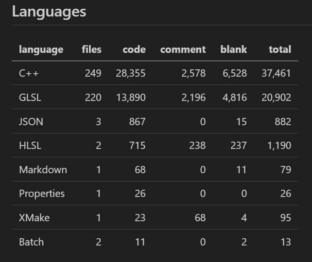
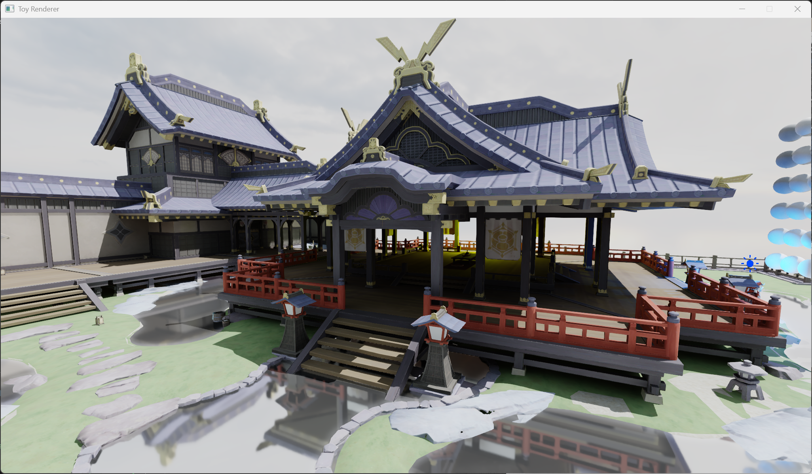
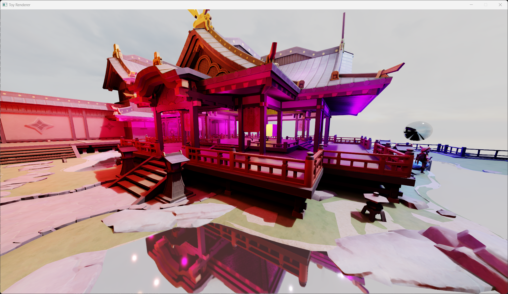
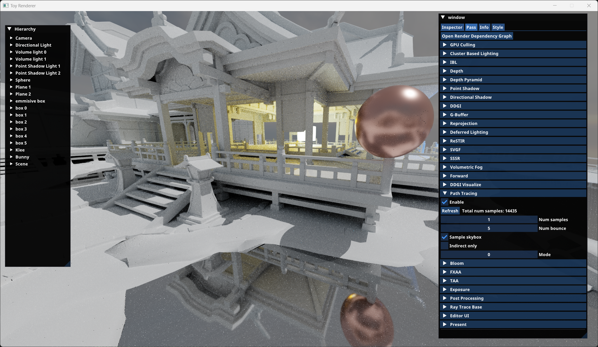
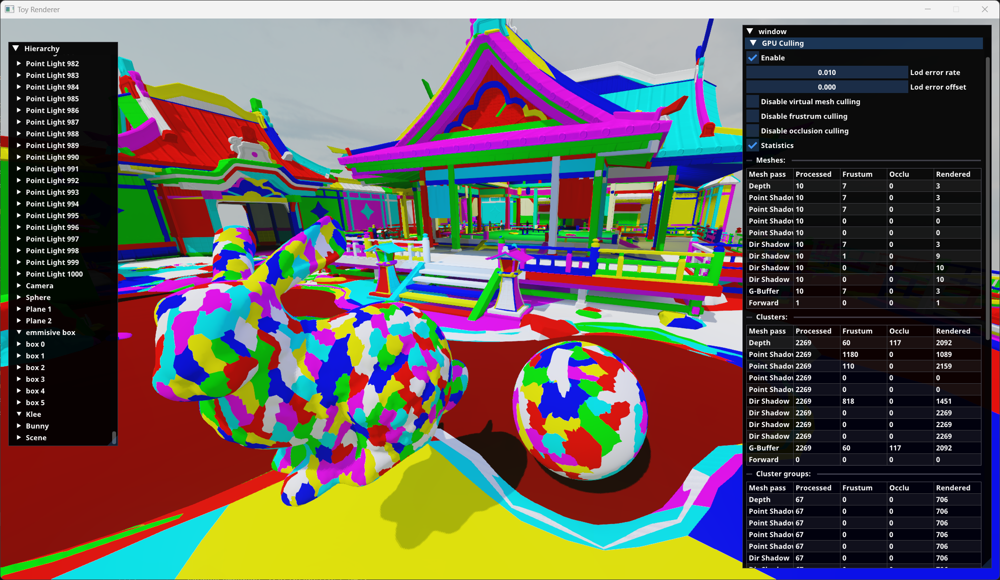
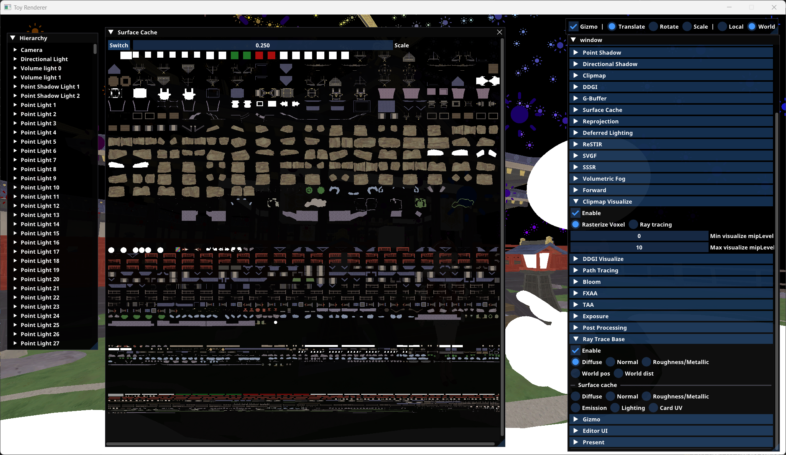
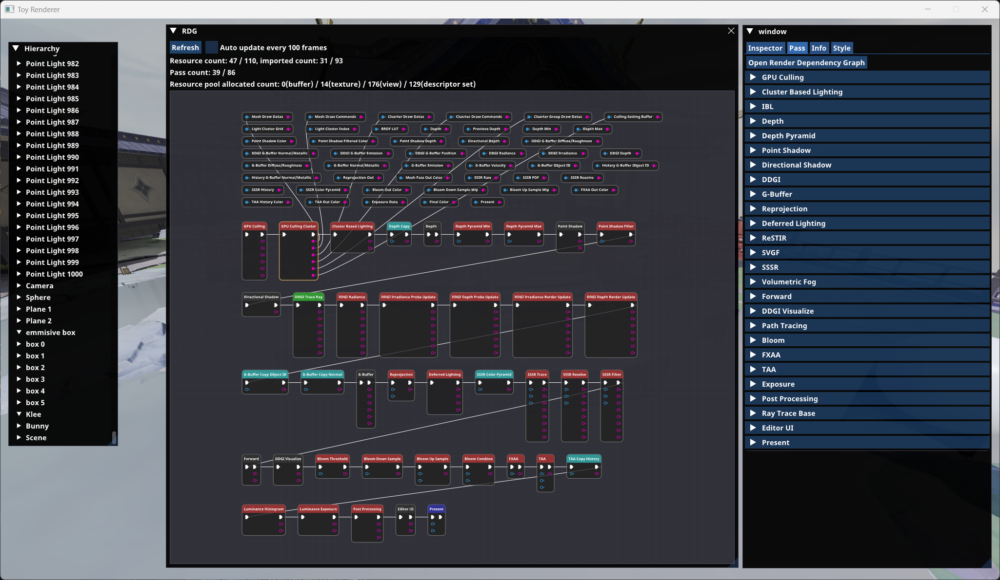
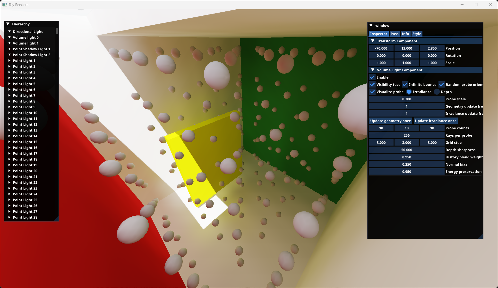
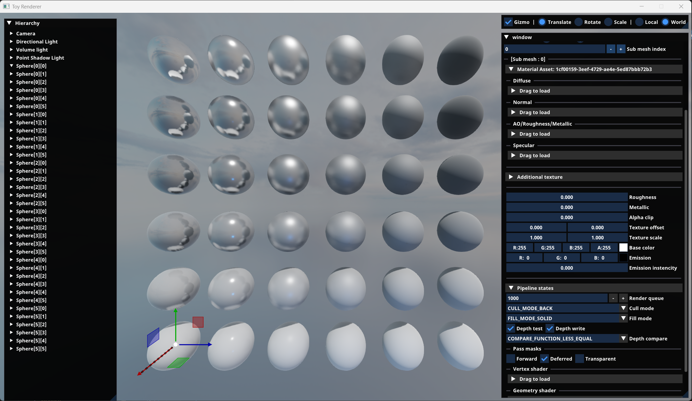
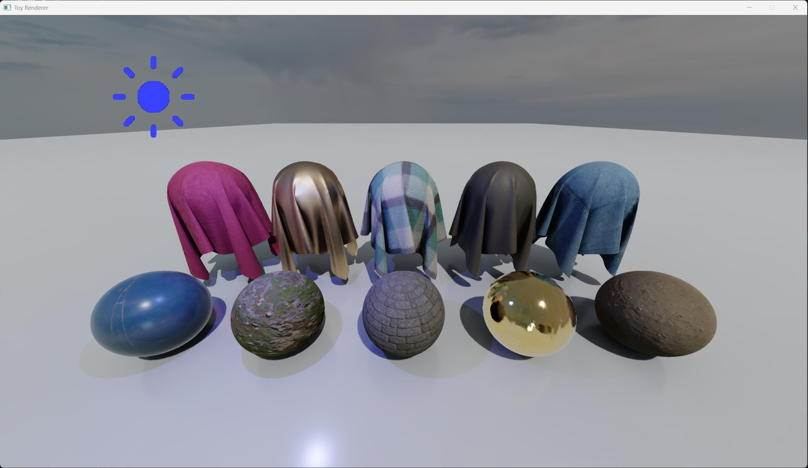

# Bob's Toy Renderer

## 关于此仓库
本仓库是我学习图形学过程中开发的一个玩具渲染器，支持基本的实时渲染算法及框架功能。

**与渲染相关的主要目录及功能如下：**
|  目录   | 功能描述  |
|  ----  | ----  |
| Asset/BuildIn/Shader/  | 着色器代码 |
| src/Runtime/Function/Render/RHI/  | 基本的RHI实现, 封装了Vulkan后端 |
| src/Runtime/Function/Render/RDG/  | 基本的RDG实现 |
| src/Runtime/Function/Render/RenderResource/  | 上层绘制资源封装及Bindless管理 |
| src/Runtime/Function/Render/RenderPass/  | 基于RDG构建的渲染管线，包含较完整的绘制流程 |
| src/Test/  | 展示了RHI及RDG层的基本使用(deprecated) |

仓库的其他部分也包含了HAL抽象，资源系统，Component-Entity-Scene等功能的简单实现。

**目前已支持的算法及功能如下：**
- RHI
- RDG
- Virtual Geometry
- GPU-Driven Pipeline
- Surface Cache             
- CSM+PCF
- EVSM
- Cluster-Based Lighting
- IBL
- DDGI
- Volumetric Fog
- SSSR                      
- Bloom
- FXAA
- TAA
- Auto Exposure
- Tone Mapping
- ReSTIR DI
- ReSTIR GI
- SVGF                      *(WIP)*
- NRD
- Path Tracing


## 构建
本仓库使用xmake作为构建工具。目前HAL抽象仅实现了windows平台，RHI仅支持Vulkan后端。

```shell
git clone https://github.com/CPJ-BO/ToyRenderer.git
cd ToyRenderer/renderer
xmake build renderer
xmake run renderer
```

## 参考链接
本仓库的学习和开发过程参考了许多优秀的开源仓库，十分感谢各位大佬的无私分享。

https://github.com/SakuraEngine/SakuraEngine  
https://github.com/google/filament  
https://github.com/EpicGames/UnrealEngine  
https://github.com/BoomingTech/Piccolo  
https://github.com/jjiangweilan/WeilanEngine  
https://github.com/Code-Guy/Bamboo  
https://github.com/flwmxd/LuxGI    
https://github.com/lukedan/ReSTIR-Vulkan  
https://github.com/diharaw/hybrid-rendering  
https://github.com/NVIDIAGameWorks/RTXDI  
https://github.com/liameitimie/learn-nanite  
https://github.com/KhronosGroup/Vulkan-Samples  
https://github.com/NVIDIA-RTX/NRD


## 截图
 
 
 
  
 

 
 



